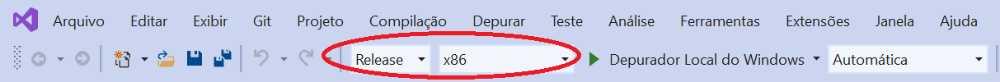

**Campinas, December 14th 2020.**

**LUSIB/UNICAMP- Ultrasound and Biomedical Instrumentation Laboratory/State University of Campinas
Authors: M.Sc. Amanda Costa Martinez, M.Sc. Johannes Medeiros and M.Sc. Mathias Scroccaro Costa**

# How to use texo from the Ultrasonix SDKs

* This repository must contain:
  * main.cpp, texo.h and texo_def.h files -> VisualStudio Project
  * texo.exe -> generated by compiling VSProject
  * config_1a and config_1b.txt -> configuration files
  * README -> instruction file

## Introduction

In our lab,  we have an ultrasound equipment
SonixMDP from Ultrassonix. This equipment can be used only for research and has two operational modes: Exam and SDKs. 
The exam mode is the same as the doctors use in their clinics to exam the patients. 
The SDK mode is the research mode, which allow us to have more liberty with the functions of the equipment.
Ultrassonix provides many Software Development Kits (SDK) and Toolboxes that can be used for research and development.

* SDKs
  * Overview
  * Ulterius™ SDK
  * RemoteCine™ SDK
  * Texo™ SDK
  * Porta™ SDK
  * Propello™ SDK
  * Amplio™ SDK
  * Impero™ SDK
  * Fluctus™ SDK
  * GPS™

* Matlab Toolboxes
  * Imaging Modes
  * SonixDataTools
  * Matlab Ulterius™
  * Matlab Texo™

* Python Toolboxes
  * PySonix

## Texo

Texo is a development toolkit that allows for lower level control of the ultrasound system for functions such custom beam sequencing, RF data acquisition, 
and better transmit and receive control. Custom sequences can be created by setting both transmit and receive parameters for a single scanline. 
The ability to set per-scanline parameters make Texo a unique tool to develop with. Texo acquires the corresponding RF data that can be used for further processing.

## How to use

We need to create a C++ project (I used VisualStudio as IDE).
In this IDE, it is necessary to configure your project to be compatible with WinXP (it is possible that will be necessary to install a package for it, 
check your VisualStudio Installer in this case)

After you compile your program and generate a binary file (.exe), you will copy this file and paste it in your ultrassonix equipment **path:..Ultrasonix/sdk---/bin**

In order to run your program in the SonixMDP you will have to access the directory from the command prompt (some commands are helpfull, like dir and ls).

To run texo_raw.exe you will have to give some information, arguments for the function. First, is it **phasedArray** or **singleRx** and second the configuration file **config_1a.txt** or **config_1b.txt**.

**texo_raw.exe singleRx config_1.txt**

After acquiring the raw data we can use the matlab script to read the data and process it.

## References

* WikiSonix - Ultrasonix™ Research Wiki
  * [WikiSonix](http://www.ultrasonix.com/wikisonix/index.php?title=Main_Page)
  

